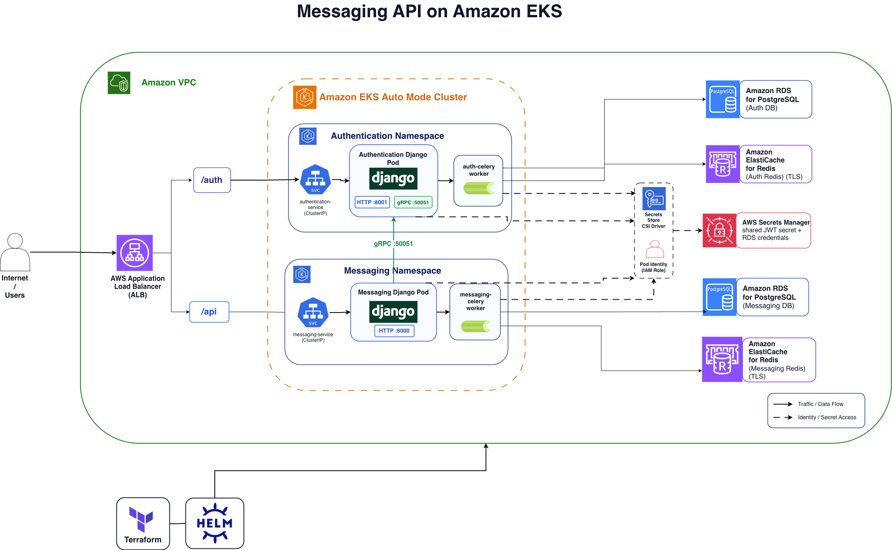

# Messaging API on Amazon EKS

A two-service messaging platform deployed on Amazon EKS with Terraform and Helm. The application is written in Python with Django and Django REST Framework, uses JWT authentication, validates messaging requests through gRPC, runs asynchronous work with Celery, and stores data in AWS-managed PostgreSQL and Redis services.

## Architecture




## Current Stack

The Terraform-managed AWS deployment creates:

- A dedicated VPC in `us-east-1` with public, private, and intra subnets.
- An Amazon EKS Auto Mode cluster with managed compute, ALB integration, and EBS support.
- A shared Application Load Balancer for path-based routing.
- A Helm release that deploys the application into Kubernetes.
- Two Kubernetes namespaces: `authentication` and `messaging`.
- `ClusterIP` Kubernetes services behind ALB IP targets.
- Two Amazon RDS for PostgreSQL instances, one for Authentication and one for Messaging.
- Two Amazon ElastiCache for Redis replication groups, one per service, with TLS enabled.
- AWS Secrets Manager for the shared JWT secret and RDS-managed database credentials.
- AWS Secrets Store CSI Driver plus EKS Pod Identity so pods can read secrets without static AWS credentials.

## Service Flow

```text
Internet users
  -> AWS Application Load Balancer
  -> /auth -> authentication-service -> Authentication Django pod
  -> /api  -> messaging-service      -> Messaging Django pod

Messaging Django pod
  -> authentication-service:50051 over gRPC for token validation
  -> Messaging RDS PostgreSQL for message data
  -> Messaging Redis over TLS for Celery broker/backend

Authentication Django pod
  -> Auth RDS PostgreSQL for user data
  -> Auth Redis over TLS for Celery broker/backend

Pods
  -> Secrets Store CSI Driver
  -> AWS Secrets Manager
```

Messaging API requests enqueue Celery tasks through Redis. The data path is best understood as:

```text
Django pod -> Redis broker -> Celery worker
```

The chart also deploys an `auth-celery` worker. The current Authentication request path registers users synchronously, while the worker remains available for auth-side async tasks.


## Main Technologies

- Application: Python, Django, Django REST Framework, Gunicorn
- Auth: SimpleJWT, HTTP-only refresh-token cookie, shared JWT signing secret
- Service-to-service auth: gRPC from Messaging to Authentication on port `50051`
- Async work: Celery workers with Redis broker/backend
- Runtime: Kubernetes on Amazon EKS Auto Mode
- Ingress: AWS Application Load Balancer with path-based routing
- Data: Amazon RDS for PostgreSQL and Amazon ElastiCache for Redis
- Secrets: AWS Secrets Manager, Secrets Store CSI Driver, EKS Pod Identity
- Delivery: Terraform and Helm

## API Routes

Authentication service:

- `POST /auth/register/`
- `POST /auth/login/`

Messaging service:

- `POST /api/write`
- `GET /api/get_all/`
- `GET /api/get_all_unread/`
- `GET /api/get_message`
- `DELETE /api/delete_message`
- `POST /api/token`
- `GET /api/test`
- `GET /api/status/<task_id>`

## Deploy

Full deployment details live in [Terraform/README.md](Terraform/README.md). The short version is below.

Create the shared JWT secret in AWS Secrets Manager:

```bash
SECRET=$(openssl rand -base64 48)

aws secretsmanager create-secret \
  --name messaging-api-shared-access-token \
  --secret-string "{\"access_token\":\"$SECRET\"}" \
  --region us-east-1 \
  --profile <PROFILE-NAME>
```

Get the secret ARN:

```bash
aws secretsmanager describe-secret \
  --secret-id messaging-api-shared-access-token \
  --region us-east-1 \
  --profile <PROFILE-NAME> \
  --query ARN \
  --output text
```

Build and push application images as `linux/amd64` or multi-arch images before deploying to EKS:

```bash
docker buildx build \
  --platform linux/amd64,linux/arm64 \
  -t saarskittel/authentication-k8s:TAG \
  -f Backend/Authentication-Service/Dockerfile \
  Backend/Authentication-Service \
  --push

docker buildx build \
  --platform linux/amd64,linux/arm64 \
  -t saarskittel/messaging-k8s:TAG \
  -f Backend/Messaging-Service/Dockerfile \
  Backend/Messaging-Service \
  --push
```

Deploy the AWS infrastructure first:

```bash
terraform -chdir=Terraform init

terraform -chdir=Terraform apply \
  -var="deploy_in_cluster_resources=false" \
  -var="db_username=postgres" \
  -var="existing_access_token_secret_arn=YOUR_SECRET_ARN"
```

Then deploy the Kubernetes resources and Helm chart after EKS is available:

```bash
terraform -chdir=Terraform apply \
  -var="deploy_in_cluster_resources=true" \
  -var="db_username=postgres" \
  -var="existing_access_token_secret_arn=YOUR_SECRET_ARN" \
  -var="auth_image=saarskittel/authentication-k8s:TAG" \
  -var="messaging_image=saarskittel/messaging-k8s:TAG"
```

Update kubeconfig and inspect the deployment:

```bash
aws eks update-kubeconfig \
  --name messaging-api-cluster \
  --region us-east-1 \
  --profile <PROFILE-NAME>

kubectl get nodes
kubectl get pods -A
kubectl get ingress -A
kubectl get secretproviderclass -A
```

If `domain_name` is left empty, the ingress matches all hosts and you can test directly through the AWS-provided ALB DNS name.

## Smoke Test

After the ingress is ready, run the end-to-end smoke test:

```bash
python3 scripts/api_smoke_test.py \
  --base-url http://YOUR_ALB_DNS_NAME \
  --skip-refresh-check
```

The script checks:

- Kubernetes pod readiness.
- Auth register and login.
- Messaging protected endpoints.
- gRPC validation from Messaging to Authentication.
- Celery task execution through Redis.
- Message write, read, list, and delete behavior.

`--skip-refresh-check` is useful when the deployed image does not yet include the local refresh-token claim fix.

## Destroy

Destroy the stack from Terraform while `deploy_in_cluster_resources=true` so Helm and Kubernetes resources are removed before EKS goes away:

```bash
terraform -chdir=Terraform destroy \
  -var="deploy_in_cluster_resources=true" \
  -var="db_username=postgres" \
  -var="existing_access_token_secret_arn=YOUR_SECRET_ARN" \
  -var="auth_image=saarskittel/authentication-k8s:TAG" \
  -var="messaging_image=saarskittel/messaging-k8s:TAG"
```

The manually supplied shared JWT secret is not owned by Terraform and is not deleted by this destroy command.
