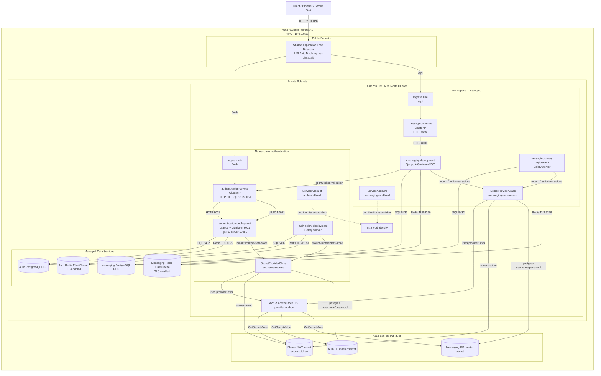

# Messaging API EKS Architecture Diagram

This file is the text source for the deployed AWS architecture.

It reflects the Terraform-managed EKS deployment path, not the Helm chart's local fallback mode with in-cluster Postgres and Redis.

## Runtime Topology

## Provisioning Flow

```mermaid
flowchart LR
    Dev[Developer / CI]
    TF[Terraform root module]
    Helm[helm_release.messaging_system]

    subgraph AWSInfra["AWS infrastructure created by Terraform"]
        VPC[VPC + subnets + NAT + route tables]
        EKS[Amazon EKS Auto Mode cluster]
        RDS[RDS PostgreSQL instances]
        Redis[ElastiCache Redis replication groups]
        SM[Secrets Manager secrets]
        PI[Pod Identity associations]
        ALBClass[IngressClassParams + IngressClass]
    end

    subgraph K8sObjects["Kubernetes objects created by Helm"]
        NS[Namespaces]
        SA[ServiceAccounts]
        Deployments[Web + Celery deployments]
        Services[ClusterIP services]
        Ingresses[Ingress rules]
        SPCs[SecretProviderClasses]
    end

    Dev -->|terraform apply| TF
    TF --> AWSInfra
    TF --> Helm
    Helm --> K8sObjects
```

## Notes

- Both application services are exposed through one shared ALB and path-based routing.
- `authentication-service` serves both REST traffic on port `8001` and gRPC on port `50051`.
- `messaging-service` serves REST traffic on port `8000` and calls the authentication service over gRPC for token validation.
- The Django web pods and Celery workers in each namespace share the same service account, Pod Identity role, and SecretProviderClass.
- In the Terraform-managed deployment, the in-cluster Postgres and Redis manifests from the chart are disabled.
